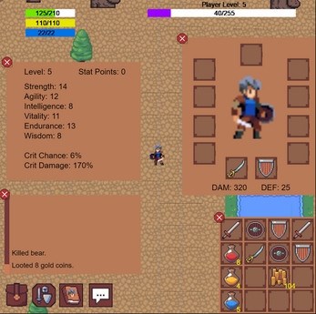
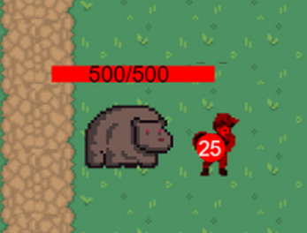
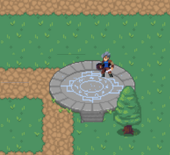
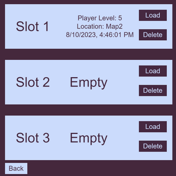
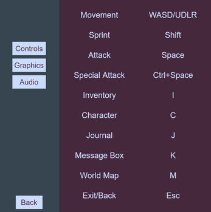
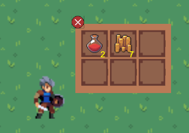

# rpg-game

Simple RPG prototype game. Only 640x640 resolution right now. Only Windows download available right now.

# Features

- Random Monster Drops
- Working Teleporter
- Working Inventory, Looting, & Equipment
- Working Loading/Saving (Only 1 save slot atm)
- 2 Maps (The one spawned in, and one to the right).
- STR/AGI/INT/VIT/END/WIS stats
- Mana and Energy Regen
- Inventory (I)
- Character (C)
- Attributes (T)
- Special Attack (Space+Ctrl)
- Normal Attack (Space)
- Movement (WASD, Up/Down/Left/Right)
- Run/Walk (Shift)
- World Map (M)
- Journal (J)
- Message Box (K)
- Options (No audio/graphics user input yet)

